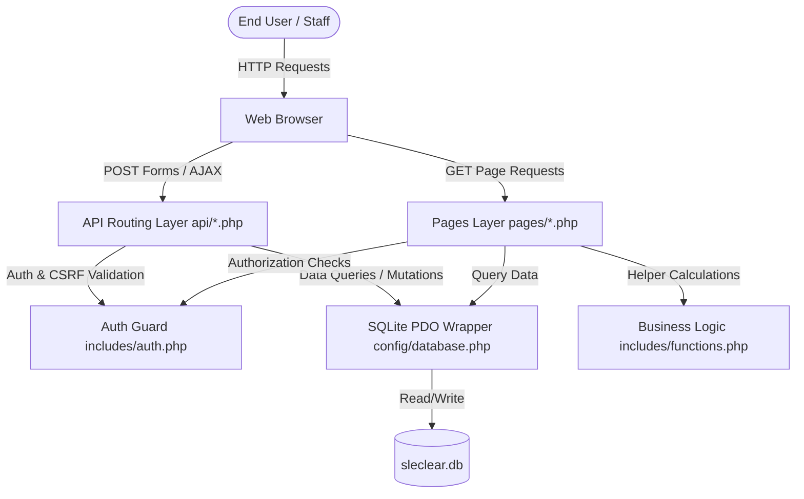

# SLeClear MIS - Technical Documentation & User Manual

Welcome to the comprehensive technical documentation and user manual for **SLeClear MIS** (Sierra Leone Student Clearance & Financial Management Information System). This document provides in-depth technical insights, installation steps, database structure details, and step-by-step user guides for all student clearance workflows.

---

## 1. System Overview & Architecture

SLeClear MIS is designed using a modular, security-hardened MVC-inspired pattern in procedural PHP, utilizing a local SQLite3 database for high performance, ease of deployment, and minimal server overhead.

### Architectural Diagram


### Security Framework
The system implements a multi-layered security framework designed to protect student records and financial data:
1. **CSRF Protection**: All state-changing forms generate a unique, cryptographically secure 32-byte CSRF token using `bin2hex(random_bytes(32))` stored in the session. Forms must submit this token, which is validated using PHP's time-attack-safe `hash_equals()` before executing database operations.
2. **Session Lifecycle Management**: Session fixation is prevented by calling `session_regenerate_id(true)` upon login. An inactivity timer tracks the user's last action; if no requests are received within 15 minutes (900 seconds), the session is destroyed, the cookie is invalidated, and the user is redirected to the login screen with a flash notice.
3. **Prepared Statements**: All database operations use `PDO` with parameterized queries, eliminating SQL injection vulnerability.
4. **Input Sanitization & Validation**: Emails are validated via `FILTER_VALIDATE_EMAIL`, phone numbers via a strict Sierra Leone format regex (`/^(+232|0)[0-9\s-]{7,14}$/`), and payments are strictly checked to ensure they are positive floats.
5. **Role-Based Access Control (RBAC)**: Users are assigned one of three roles: `Admin`, `Finance`, or `Registry`. Access is guarded at both the presentation layer (pages) and control layer (APIs).

---

## 2. Technical Installation & Configuration

### Prerequisites
- **PHP**: Version 8.0 or newer.
- **SQLite3**: Ensure the PHP extension `pdo_sqlite` is installed and active.
- **Web Server**: Apache, Nginx, or the built-in PHP development server.

### Local Setup Instructions

1. **Clone or Extract Files**:
   Ensure all files are placed in your web directory (e.g., `/var/www/html/sleclear-mis` or a local folder of your choice).

2. **Verify SQLite Support**:
   Run the following CLI command to confirm that your PHP installation supports SQLite:
   ```bash
   php -r "echo extension_loaded('pdo_sqlite') ? 'PDO SQLite is active' : 'Error: PDO SQLite is missing';"
   ```

3. **Launch the Server**:
   You can start PHP's built-in server inside the project root:
   ```bash
   php -S localhost:8000
   ```

4. **Initialize Database**:
   On your first visit to `http://localhost:8000`, the system automatically runs `config/database.php`. This creates the file `data/sleclear.db`, builds all necessary tables, and seeds the default system users.

---

## 3. Database Schema

The database is built on SQLite3 and consists of six tables optimized with relational foreign keys.

```mermaid
erDiagram
    USERS {
        int id PK
        string username UNIQUE
        string password
        string full_name
        string email
        string role
        int is_active
        datetime created_at
    }
    STUDENTS {
        int id PK
        string student_id UNIQUE
        string first_name
        string last_name
        string email
        string phone
        string department
        string faculty
        string level
        string academic_year
        float total_fees
        datetime created_at
        datetime updated_at
    }
    PAYMENTS {
        int id PK
        int student_id FK
        float amount
        string payment_date
        string payment_method
        string receipt_number
        string description
        int recorded_by FK
        datetime created_at
    }
    CLEARANCES {
        int id PK
        int student_id FK
        string academic_year
        string semester
        string status
        string notes
        int cleared_by FK
        datetime cleared_at
    }
    DEFERRED_ASSESSMENTS {
        int id PK
        int student_id FK
        string course_code
        string course_name
        string reason
        float fee_amount
        int fee_paid
        string status
        string document_path
        datetime submitted_at
        int reviewed_by FK
        datetime reviewed_at
    }
    ACTIVITY_LOG {
        int id PK
        int user_id FK
        string action
        string details
        datetime created_at
    }

    STUDENTS ||--o{ PAYMENTS : pays
    STUDENTS ||--o{ CLEARANCES : cleared
    STUDENTS ||--o{ DEFERRED_ASSESSMENTS : applies
    USERS ||--o{ PAYMENTS : records
    USERS ||--o{ CLEARANCES : approves
    USERS ||--o{ DEFERRED_ASSESSMENTS : reviews
    USERS ||--o{ ACTIVITY_LOG : performs
```

### Table Structure Specifications

#### 1. `users`
Stores administrative, financial, and registry staff account details.
- `id` (INTEGER, PK, AUTOINCREMENT)
- `username` (TEXT, UNIQUE, NOT NULL)
- `password` (TEXT, NOT NULL) — Bcrypt hashed.
- `full_name` (TEXT, NOT NULL)
- `email` (TEXT)
- `role` (TEXT, CHECK: 'Admin', 'Finance', 'Registry')
- `is_active` (INTEGER, DEFAULT 1)
- `created_at` (DATETIME, DEFAULT CURRENT_TIMESTAMP)

#### 2. `students`
Primary academic records of students.
- `id` (INTEGER, PK, AUTOINCREMENT)
- `student_id` (TEXT, UNIQUE, NOT NULL) — e.g., "USL/2026/0001"
- `first_name` (TEXT, NOT NULL)
- `last_name` (TEXT, NOT NULL)
- `email` (TEXT)
- `phone` (TEXT)
- `department` (TEXT, NOT NULL)
- `faculty` (TEXT, NOT NULL)
- `level` (TEXT, NOT NULL) — Year level (e.g., 100, 200, 300, 400).
- `academic_year` (TEXT, NOT NULL)
- `total_fees` (REAL, DEFAULT 0.0) — Total billed amount for the academic year.
- `created_at` (DATETIME, DEFAULT CURRENT_TIMESTAMP)
- `updated_at` (DATETIME)

#### 3. `payments`
Tracks all financial installments or complete payments made by students.
- `id` (INTEGER, PK, AUTOINCREMENT)
- `student_id` (INTEGER, FK references `students(id)`)
- `amount` (REAL, NOT NULL)
- `payment_date` (TEXT, NOT NULL)
- `payment_method` (TEXT, NOT NULL) — e.g., Cash, Bank Transfer, Mobile Money.
- `receipt_number` (TEXT)
- `description` (TEXT)
- `recorded_by` (INTEGER, FK references `users(id)`)
- `created_at` (DATETIME, DEFAULT CURRENT_TIMESTAMP)

#### 4. `clearances`
Maintains status overrides and compliance metrics.
- `id` (INTEGER, PK, AUTOINCREMENT)
- `student_id` (INTEGER, FK references `students(id)`)
- `academic_year` (TEXT, NOT NULL)
- `semester` (TEXT, NOT NULL)
- `status` (TEXT, CHECK: 'Cleared', 'Pending', 'Provisional', 'Denied')
- `notes` (TEXT)
- `cleared_by` (INTEGER, FK references `users(id)`)
- `cleared_at` (DATETIME)

#### 5. `deferred_assessments`
Manages applications from students seeking to postpone examinations.
- `id` (INTEGER, PK, AUTOINCREMENT)
- `student_id` (INTEGER, FK references `students(id)`)
- `course_code` (TEXT, NOT NULL)
- `course_name` (TEXT, NOT NULL)
- `reason` (TEXT, NOT NULL)
- `fee_amount` (REAL, DEFAULT 0.0) — Standard deferral fee.
- `fee_paid` (INTEGER, DEFAULT 0) — 0 = Unpaid, 1 = Paid.
- `status` (TEXT, CHECK: 'Pending', 'Approved', 'Denied')
- `document_path` (TEXT) — Relative server path to uploaded PDF/Image attachment.
- `submitted_at` (DATETIME, DEFAULT CURRENT_TIMESTAMP)
- `reviewed_by` (INTEGER, FK references `users(id)`)
- `reviewed_at` (DATETIME)

#### 6. `activity_log`
Chronological audit ledger capturing security events, modifications, and actions.
- `id` (INTEGER, PK, AUTOINCREMENT)
- `user_id` (INTEGER, FK references `users(id)` or NULL)
- `action` (TEXT, NOT NULL) — e.g., Login, Update Student, Set Clearance.
- `details` (TEXT)
- `created_at` (DATETIME, DEFAULT CURRENT_TIMESTAMP)

---

## 4. User Manual (Step-by-Step Guide)

SLeClear features a tailored dashboard experience adjusted to your specific user role.

### A. Signing In

1. Open your browser and navigate to the system URL (e.g., `http://localhost:8000`).
2. Enter your assigned **Username** and **Password**.
3. For testing environments, you can click any of the **Quick Demo Login** buttons at the bottom to automatically fill in the test user credentials.
4. Click **Sign In**.

*Note: If you leave the dashboard open without any interactions for 15 minutes, you will be automatically signed out to prevent unauthorized terminal access.*

### B. Student Management (Admissions & Registry)
*Access limited to Admin and Registry roles.*

#### Registering a Student
1. Navigate to **Students** from the left navigation panel.
2. Click **Register Student** at the top right of the directory.
3. Complete the form:
   - **Student ID**: Unique university number (e.g., `USL/2026/1024`).
   - **Full Name, Email, and Phone Number** (Phone must follow local formats like `+232 77 123456` or `076 112233`).
   - **Faculty & Department**: Select appropriate faculties.
   - **Billed Fees**: Enter total annual fees.
4. Click **Register Student**.

#### Modifying/Deleting Students
- To update details, click the **Edit (Pencil)** icon in the Students list.
- Admin users can click the **Delete (Trash)** icon to delete a student. *Warning: Deleting a student permanently purges their associated payment and clearance records.*

### C. Recording Fees & Tuition Payments
*Access limited to Admin and Finance roles.*

1. Go to the **Payments** page from the sidebar.
2. Click **Record Fee Payment**.
3. **Select Student**: Start typing or select a student from the searchable dropdown. The system automatically fetches their **Total Billed Fees** and displays their **Outstanding Balance**.
4. Input the **Payment Amount**.
5. Select the **Payment Method** (Cash, Bank Transfer, Mobile Money, Cheque) and input a **Receipt/Transaction ID** for tracking.
6. Click **Record Payment**.
7. The system registers the payment and automatically runs the balance checker. If outstanding fees are now **0.00**, the student's status is automatically upgraded to **Cleared**.

### D. Clearances & Manual Overrides
*Available to Admin, Finance, and Registry (view-only).*

The **Clearances** page shows a unified roster of students who have explicit clearance records, alongside those whose clearance status is implicitly pending.

#### Performing a Manual Overriding Action
Institutions sometimes grant clearance to students with outstanding balances under special conditions (e.g., scholarships, payment plans).
1. Go to the **Clearances** page.
2. Find the student in the table.
3. Under the **Notes / Override Status** column, select the desired status:
   - **Cleared**: Manually force complete clearance.
   - **Provisional**: Temporary clearance granted.
   - **Denied**: Explicit block on clearance.
4. Enter the reason for the override in the text field (e.g., "Sponsor promise letter received").
5. Click the **Save / Set** button next to the input fields.
6. The override status is immediately applied, logged, and signed by your user ID.

#### Printing Clearance Slips
- For any student with a clearance record, click the **Slip** button in the clearance table.
- A printable popup will display containing a modern student clearance slip complete with institutional branding, compliance badges, and security details. Click **Print Certificate** to print or save it as a PDF.

### E. Deferral Applications & Supporting Files
*Available to all roles; approvals limited to Admin and Finance.*

Students who cannot take examinations due to medical issues, personal emergencies, or fee delay agreements can apply to defer their courses.

#### Applying for Deferral
1. Navigate to the **Deferred Exams** module.
2. Click **Apply for Deferral**.
3. Select the student, input the **Course Code** (e.g., `CS-401`), **Course Title**, and select **Deferral Fee Paid** if the processing fee has been collected.
4. Provide a detailed description in the **Reason** field.
5. In the **Supporting Document** field, click and select the student's medical note, approval letter, or proof of circumstances (Supported formats: PDF, JPG, PNG, DOC/DOCX; Max size: 5MB).
6. Click **Submit Application**.

#### Reviewing Deferrals
- Finance officers and Admins can approve or deny pending deferral applications directly in the Deferred Exams directory table.
- Click the **View** link under the Document column to download or view the student's attached supporting file.
- Change the status dropdown to **Approved** or **Denied**, toggle the payment check box, and click **Save**.

### F. Reports & CSV Exports
*Available to Admin and Finance roles.*

1. Select **Financial Reports** from the sidebar.
2. This screen shows overall financial analytics, including:
   - Total expected collections, actual collected revenues, and outstanding debts.
   - Live activity streams of recent overrides and transactions.
3. To export raw datasets, scroll to the **Data Export Console** and click any of the export buttons:
   - **Export Students**: Downloads `students_export_[timestamp].csv`.
   - **Export Payments**: Downloads `payments_ledger_[timestamp].csv`.
   - **Export Clearances**: Downloads `clearance_registry_[timestamp].csv`.

---

## 5. Developer Guide & Interoperability API

For developers extending SLeClear MIS or integrating it with government platforms (like Sierra Leone's Ministry of Technical and Higher Education databases):

### REST JSON API Reference
All responses return JSON. Requires a valid authenticated session cookie (`PHPSESSID`) passed in the headers.

#### 1. System Statistics
- **Endpoint**: `GET /api/data.php?resource=summary`
- **Output**: Returns academic statistics, collection ratios, and clearance distributions.
- **Example Response**:
  ```json
  {
    "resource": "summary",
    "generated_at": "2026-06-11T12:00:00Z",
    "system": "SLeClear MIS — Sierra Leone Student Clearance & Financial MIS",
    "totals": {
      "students": 12,
      "payments": 18,
      "collected_leones": 185000,
      "outstanding_leones": 45000,
      "deferred_applications": 2
    },
    "clearance_breakdown": {
      "Cleared": 8,
      "Pending": 3,
      "Provisional": 1
    }
  }
  ```

#### 2. Student Records
- **Endpoint**: `GET /api/data.php?resource=students&limit=50&offset=0`
- **Parameters**: `limit` (max 500, default 100), `offset` (default 0)
- **Output**: Returns list of student accounts with exact outstanding balances and payment summaries.

#### 3. Payment Ledger
- **Endpoint**: `GET /api/data.php?resource=payments&limit=100`
- **Output**: Returns lists of individual payment transactions.

#### 4. Compliance Clearances
- **Endpoint**: `GET /api/data.php?resource=clearances&status=Cleared`
- **Parameters**: `status` (Optional: Cleared, Pending, Provisional, Denied)
- **Output**: Returns current list of active clearance status entries.

---

## 6. Sustainable Development Goals (SDG) Alignment

SLeClear MIS is built to support international indicators for sustainable development:

### SDG Goal 4: Quality Education
- **Target 4.1 & 4.3**: By digitizing fee management, SLeClear MIS prevents administrative errors from incorrectly blocking students from sitting exams.
- **Vulnerability reduction**: The provisional clearance and exam deferral features provide structured fallback options for students with financial difficulties, helping to ensure they do not drop out of their courses due to short-term unpaid balances.

### SDG Goal 10: Reduced Inequalities
- **Target 10.2**: The platform implements objective, logic-driven fee thresholds for clearances. If a student is fully paid, they are immediately cleared. 
- **Accountability**: Manual overrides are recorded in the audit log with the approving officer's ID, reducing the risk of administrative bias or corrupt gatekeeping.
